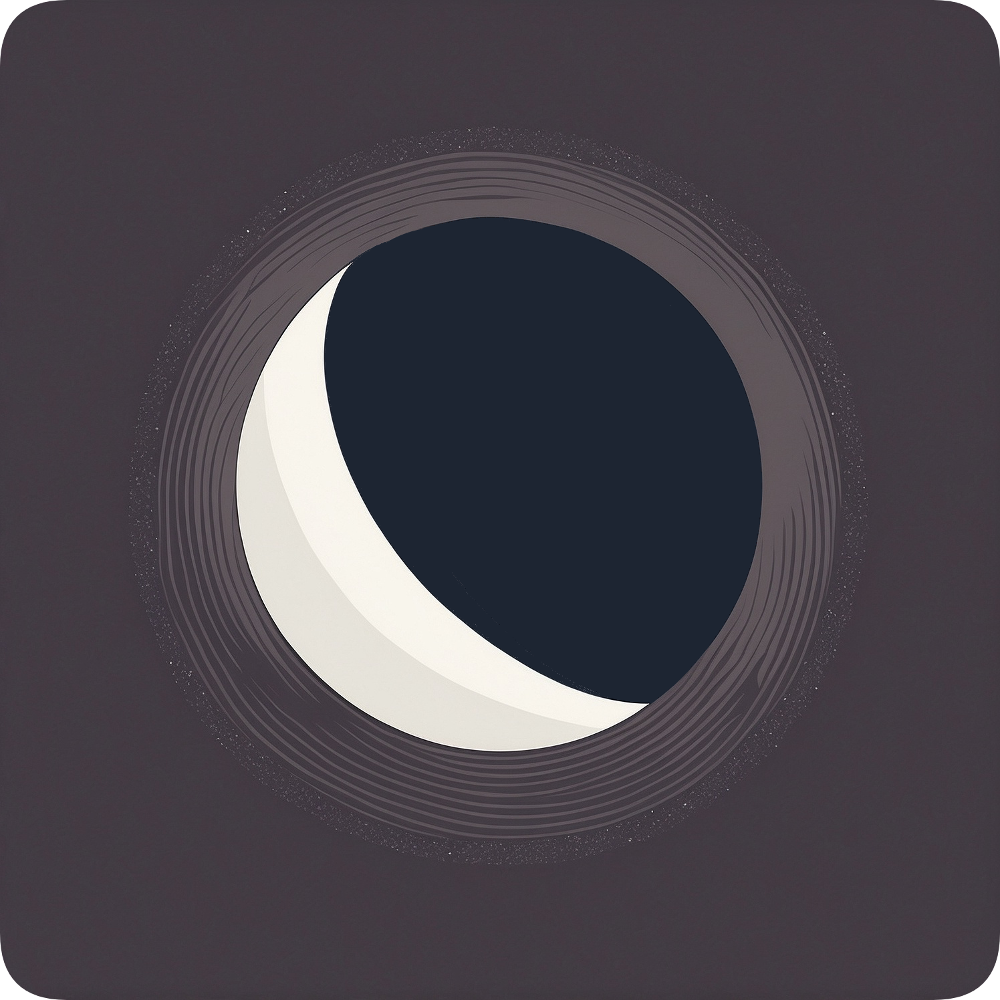

<p align="center">
  
</p>

<p align="center">
    
    
    
</p>

# Moonbeam

Moonbeam optimizes settings for [Moonlight](https://moonlight-stream.org), adapting to your system and network conditions. 

## Features

- 🤖 Auto-tuning Moonlight settings
- 🔌 Reconnect automatically on disconnection
- ⚖️ Prioritize FPS, resolution, or bandwidth
- 🧩 Scriptable and launcher-friendly


## Prerequisites

- Linux operating system
- [Nix package manager](https://nixos.org/download.html)
- [Moonlight](https://moonlight-stream.org) and [Sunshine](https://github.com/LizardByte/Sunshine) installed and configured

## Installation

Moonbeam can be installed using the Nix package manager. For detailed installation instructions, please refer to the [Installation Guide](https://docs.moonbeam.ing/getting-started/installing-moonbeam) in our documentation.

## Quick Start

1. Start an `iperf3` server on your host PC:

   ```bash
   iperf3 -s -p 31347
   ```

2. Launch Moonbeam with:

   ```bash
   moonbeam stream <host> <app>
   ```

   Replace `<host>` with your gaming PC's hostname or IP, and `<app>` with the game or application you want to stream.

For more usage examples and advanced configurations, refer to the [Streaming Basics](https://docs.moonbeam.ing/getting-started/streaming-basics) section.

## Documentation

Comprehensive documentation for Moonbeam is available at [docs.moonbeam.ing](https://docs.moonbeam.ing/).

## Contributing

We welcome contributions! Please see our [Contributing Guide](https://docs.moonbeam.ing/reference/contributing) for more information.

## License

Moonbeam is released under the GPL2 license.
